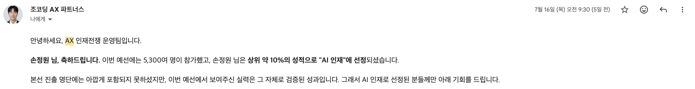

# AX Mafia

AX 인재전쟁 2026 예선 참가를 위해 만든 GitHub organization입니다.

## 활동 개요

AX 인재전쟁 2026은 OpenAI × 조코딩AX파트너스 채용 해커톤입니다. 대기업과 다양한 도메인 기업이 제시한 실제 업무 문제를 AI 도구로 해결하고, 결과물을 Codex 플러그인 형태로 제출하는 실전형 해커톤입니다.

- 메인 링크: https://hackathon.jocodingax.ai/
- 예선 기간: 2026.06.23 ~ 2026.07.10
- 본선 진출자 발표: 2026.07.15
- 본선: 2026.07.18 오프라인 해커톤

## 선택 기업

이번 예선에서는 기업별 문제를 분리해 다루기 위해 아래 세 기업을 선택했습니다.

- 무신사
- 채널톡
- 카카오페이증권

## 현재 제출물

예선 과제 조건에 맞춰 기업별로 별도 Codex 플러그인을 구성했습니다.

| 기업 | 제출물 | 해결 문제 | 상태 |
| --- | --- | --- | --- |
| 무신사 | `musinsa-product-risk-auditor` | 온라인 패션 상품 상세 페이지에서 교환/반품/환불, 상품 정보, 정품/검수, 배송, 사이즈/핏, 리뷰 신뢰 리스크를 사전에 점검 | `submission.zip` 생성 완료 |
| 채널톡 | `channel-ai-cs-diagnosis` | AI 상담 로그에서 반복 문의, 챗봇 실패/미해결 신호, 상담원 연결 필요 신호, FAQ 개선 후보를 진단 | `submission.zip` 생성 완료 |
| 카카오페이증권 | `kakaopaysec-voc-triage` | 증권 VOC/고객상담 텍스트의 긴급도, 금융사고성, 주문장애/보상 증빙 필요 여부, FAQ 개선 후보를 분류 | `submission.zip` 생성 완료 |

각 제출물은 과제 요구 구조에 맞춰 `src/.codex-plugin/plugin.json`, `src/skills/*/SKILL.md`, 실행 코드, 공개 근거 자료, 검증 결과, 원본 로그를 포함합니다.

## 결과

예선 참가자 약 5,300명 중 **상위 약 10%의 성적**을 기록하여  
운영팀이 선정한 **‘AI 인재’**에 포함되었습니다.

본선 진출에는 아쉽게 실패했지만, 무신사·채널톡·카카오페이증권의 실제 업무 문제를 분석하고  
각 문제를 Codex 플러그인 형태로 구현한 결과와 AI 활용 역량을 인정받았습니다.